# 318 川藏南线骑行计划

> 此计划为个人使用，继承自[笨笨的 57318 攻略 2019 版](url_to_be_added) 与 [期末的西藏旅游攻略](https://www.bilibili.com/read/cv12052461/)
>
> 信息来源：
>
> 公众号 57 川藏服务站（原骑行川藏吧），网站[吾骑 318](https://www.weizan.cn/f/s-1615)，笨笨微信 13568816951

## 概述

川藏线一般指成都到拉萨的路线，按目前骑行圈的习惯可分为三条线路。

1. 川藏南线即 318 国道

   自成都经雅安、天全、泸定、康定、雅江、理塘、巴塘、芒康、左贡、八宿、波密、林芝到达拉萨。

   总里程 2100 公里，行者路书编号：424316

2. 川藏北线即 317 国道

   北线分为大北线，即成都出发经汶川、理县到炉霍前全程走 317 国道，我们多数一般先经 S303 翻巴朗山到小金，丹巴，道孚，甘孜，德格，江达，昌都，类乌齐，丁青，巴青，索县，那曲转 G109 当雄到拉萨。

   总里程 2230 公里，行者路书编号：796441

3. 川藏中线

   这条线目前里面的路况，吃住信息了解不多，但政府正在加大力度修路，他是介于 318 国道与 317 国道之间，经新龙到贡觉、察雅、嘉黎县，再从墨竹工卡出来到拉萨的一条道路。

   总里程约 2200 公里，行者路书编号：792229

## 时间

### 出发时间

每年 3 月川藏线还较冷，但 3 月的成都到处是春暖花开，林芝也是桃花三月的季节，每年 3 月底为林芝桃花节。3 月初的成都晚上小雨，白天晴，3 月下旬与 4 月初会有小雨。其他地段还处于冬季，遇到下雪的机率很高，不过 318 大雪封山的机率也非常低。

各种骑行活动从 4 月开始拉开序幕，但天气同样比较冷，路上遇到下雪的机率也很高

每年 5 月初是中老年骑友出发的高峰期，这个时间比较适合骑行，外地出发骑到成都再进藏的也多（外地骑到成都入住 57 客栈将会获得 57 蜀道传骑奖牌）

每年 6 月中旬开始进入雨季

7 月各大学校开始放假，学生群居多，雨季进入高潮，塌方落石等地质灾害频发，8 月下旬雨季进入尾声

8 月初，学生娃最后一波出发高峰

9/10 月初也是一小波出发高峰，10 月高原进入金秋十月，非常漂亮，几乎没有雨水，

自驾高峰，国庆最好避开新都桥住宿，因为价格暴涨，10 月初藏区还会有一波寒流。

骑行淡季，约伴相对来说不容易，全年最冷的时间是春节前后，逆风最强劲的时间为 11 月到 4 月。

318 沿线客栈老板多数从 12 月开始回家，3 月底返回 318，但川藏南线全年一路吃住都不会困难。

全年最冷的时间莫过于春节前后

### 骑行时间

| 体力 | 时间 | 骑行经验（平原日行并且第二天有良好状态） |
| ---- | ---- | ---------------------------------------- |
| 强   | 13   | 400                                      |
| 稍强 | 20   | 300                                      |
| 中等 | 25   | 150                                      |
| 稍弱 | 30   | 100                                      |

## 路线

路书编号：424316

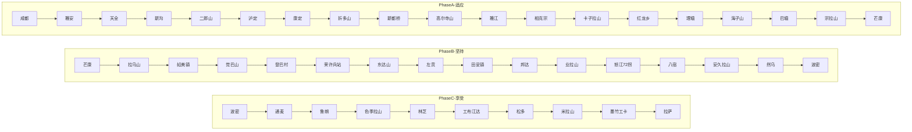

> 日程参考

| 天数  | 出发地（海拔）— 目的地（海拔） | 总里程 | 大概用时             | 路况                                         |
| ----- | ------------------------------ | ------ | -------------------- | -------------------------------------------- |
| Day1  | 成都（512）-雅安（641）        | 130km  | 10 小时 早点出发     | 平路+起伏路                                  |
| Day2  | 雅安（614）-新沟（1330）       | 85km   | 8 小时               | 起伏上坡路+小部分烂路                        |
| Day3  | 新沟（1330）-泸定（1330）      | 51km   | 5 小时               | 上坡+穿越二郎山隧道（海拔 2170）+长下坡      |
| Day4  | 泸定（1330）-折多塘（3222）    | 70km   | 8 小时 早点出发      | 路过康定（2395） 康定没有情歌只有坡          |
| Day5  | 折多塘（3222）-新都桥（3530）  | 60km   | 6 小时               | 上坡+翻越折多山（4298）+长下坡               |
| Day6  | 新都桥（3530）-相克宗（3543）  | 90km   | 9 小时               | 长上坡+翻越高尔寺山（4412）+长下坡           |
| Day7  | 相克宗（3543）-红龙乡（4163）  | 80km   | 10 小时 早点出发     | 上坡起伏路为主+翻越卡子拉山口（4718）        |
| Day8  | 红龙乡（4163）-理塘（4014）    | 35km   | 4 小时               | 轻松平路+小坡                                |
| Day9  | 理塘（4014）-禾尼乡（4201）    | 55km   | 4 小时               | 全程好路                                     |
| Day10 | 禾尼乡（4201）-巴塘（2580）    | 120km  | 8 小时               | 20km 起伏路+上坡+超长下坡 翻越海子山（4685） |
| Day11 | 巴塘（2580）-芒康（3875）      | 110km  | 10 小时 天没亮出发！ | 翻越宗拉山（4170） 50km 上坡 这一天太难了！  |
| Day12 | 芒康（3875）-如美（2640）      | 50km   | 4 小时               | 翻越拉乌山（4376）                           |
| Day13 | 如美（2640）-容许兵站（4046）  | 50km   | 6 小时               | 海拔慢慢爬升，小上坡                         |
| Day14 | 荣许兵站（4046）-左贡（3877）  | 60km   | 8 小时               | 翻越东达山（5130）长山坡+长下坡              |
| Day15 | 左贡（3877）-邦达（4120）      | 105km  | 8 小时               | 起伏路                                       |
| Day16 | 邦达（4120）-八宿（3280）      | 100km  | 9 小时               | 翻越业拉山（4658）长上坡+长下坡              |
| Day17 | 八宿（3280）-然乌（3960）      | 90km   | 11 小时 早点出发     | 翻越安久拉山（4475）+60km 长上坡+长下坡      |
| Day18 | 然乌（3960）-波密（2725）      | 130km  | 7 小时               | 下坡起伏路                                   |
| Day19 | 波密（2725）-通麦（2070）      | 120km  | 8 小时               | 长上坡+长下坡                                |
| Day20 | 通麦（2070）-鲁朗（3285）      | 70km   | 8 小时               | 起伏路面，旺季提前定房                       |
| Day21 | 鲁朗（3285）-八一（2930）      | 110km  | 9 小时               | 长上坡+起伏路+长下坡                         |
| Day22 | 八一（2930）-工布江达（3440）  | 130km  | 8 小时               | 平路+起伏路                                  |
| Day23 | 工布江达（3440）-松多（4170）  | 100km  | 7 小时               | 起伏路                                       |
| Day24 | 松多（4170）-拉萨（3650）      | 170km  | 12 小时 天没亮出发！ | 翻越米拉山（5013）长上坡+长下坡              |

## 骑行前

体能：至少每周累计骑行 200 公里，至少一周一次来回 120 公里，连续锻炼三个月

其他：跑步，静蹲，深蹲，站直侧抬腿

经验：衣食住行，天时地利人和（体能、装备和钱）

组队：不要提前太久防鸽子，速度、性格、消费相似的才是真队友

合理安排行程，不要拉爆自己。注意**保护膝盖！**

在地图上标记兴趣点

拍照回来后可以打印做成相册

邮局可以寄明信片，或买一块 318 地图布沿途盖章

### 预算

- 成都去及拉萨回路费
- 车价 1500-3500
  ```
  2018 年 57318 卖的几款常见车型
  1，喜德盛逐日 300，价格 **1498** 元，24 速彦豪油刹，前叉肩控锁死
  2，喜德盛逐日 800，价格 2198 元，27 速，喜玛诺油刹，前叉线控锁死，中空牙盘
  3，美利达公爵 500，价格 2298 元，27 速，喜玛诺油刹，前叉线控锁死，实心中轴
  4，捷安特 ATX830，价格 2398 元，27 速，喜玛诺油刹，前叉线控锁死，实心中轴
  5，美利达公爵 600，价格 2698 元，27 速，喜玛诺油刹，前叉线控锁死，中空牙盘
  6，喜德盛传骑 500PLUS，价格 3599 元，22 速，喜玛诺油刹，前叉线控锁死，中空牙盘
  7，捷安特 XTC800，价格 3298 元，30 速，喜玛诺油刹，前叉线控锁死，中空牙盘
  以上车型上门自提均送定制长途钢货架，码表，车前包，锁，青蛙灯，水壶架
  ```
- 骑行装备 700-1200
- 衣服及生活用品 500+
- 每日开支 100+（总计约 3000-3500）
- 拉萨纪念品及其他开支

> 总计准备 1w 左右

### 装备

#### 车身装备

| 名称   | 数量 | 说明                                               |
| ------ | ---- | -------------------------------------------------- |
| 单车   | 1    | 御三家，价格适中，成都买拉萨卖，或租车，或自己带车 |
| 前后灯 | 1    | 必备，隧道多，尽量不要夜骑                         |
| 青蛙灯 | n    | 增加照明和辨识度                                   |
| 内胎   | 2    | 山地 2 条，公路 3 条                               |
| 货架   | 1    | 首选钢货架                                         |
| 驮包   | 1    | 中号 40 升左右足够，首选高大威。车前包选用         |
| 防雨罩 | 1    | 防雨防尘                                           |
| 绑带   | 1-2  | 固定额外行李                                       |

#### 人身装备

| 名称           | 数量 | 说明                                                          |
| -------------- | ---- | ------------------------------------------------------------- |
| 头盔           | 1    | 安全第一，一定要戴，质量尽可能好                              |
| 魔术头巾       | 2    | 物理防晒防风，冬季需要抓绒面罩                                |
| 骑行眼镜       | 1    | 防强光防风沙                                                  |
| 骑行小帽       | 1    |                                                               |
| 速干衣         | 2    | 内层排汗                                                      |
| 冲锋衣         | 1    | 含抓绒内胆，必备                                              |
| 防晒袖套、腿套 | 2    | 短袖骑行服配，或直接用长袖骑行服                              |
| 全指手套       | 2    | 薄款+抓绒款，夏季半指也能用就是手指会黑，冬季需要防风滑雪手套 |
| 分体雨衣       | 1    | 必备，不建议雨披，或用冲锋衣+冲锋裤代替                       |
| 防雨鞋套       | 2    | GIYO 鞋套                                                     |
| 常服           | 1    | 包括上衣、裤子、鞋子，一套                                    |
| 洞洞鞋         | 1    |                                                               |
| 束裤带         | 2    |                                                               |
| 护膝           | 1    | 必备，保护膝盖                                                |
| 腰包           | 1    | 装身份证手机等常用小物件，可用骑行服口袋代替                  |
| 速干内裤       | 2    | 骑行裤不需要穿内裤，一条也够                                  |
| 袜子           | 3    | 有骑行袜，三双最多，速干袜+保暖袜\*2                          |

> 衣服携带指南：
> 全年基本骑车是贴身穿速干衣，外面套冲锋衣为主，下山冷就套分体雨衣。
> 裤子两条收裤口的运动裤，或一条运动裤，一条骑行裤，气温低的季节加两条速干秋裤即可，膝盖套护膝，下山冷同样套雨裤。
> 冬季比如 10 月到 4 月，冲锋衣外加一件单薄的羽绒服就可以了。

#### 维护工具

| 名称       | 数量 | 说明                                         |
| ---------- | ---- | -------------------------------------------- |
| 补胎套装   | 1    | 补胎片，胶水，撬胎棒，挫片。低温不要买免胶的 |
| 打气筒     | 1    | 或充气宝                                     |
| 截链器     | 1    |                                              |
| 魔术扣     | 1    | 按速别配备                                   |
| 斜口指甲剪 | 1    | 拔除扎进外胎的钢丝                           |
| 链条油     | 1    | 长距离骑行，勤上油                           |
| 来令片     | 2    | 中途可以换一对                               |
| 锁片       | 1    | 锁片额外带一对                               |

#### 其他

| 名称           | 数量 | 说明                                              |
| -------------- | ---- | ------------------------------------------------- |
| 充电器         | n    | 各类设备的充电器                                  |
| 充电宝         | 1    | 20000mAh 大容量，以及各类数据线，电池仓，存储卡包 |
| 手机           | 1    | 电信移动双卡                                      |
| 相机和运动相机 | 1    | 无人机                                            |
| 降噪耳机       | 1    | 防呼噜                                            |
| 蓝牙音响       | 1    | 听歌                                              |
| 码表           | 1    |                                                   |
| 马克笔         | 1    |                                                   |
| 急救包         | 1    | 常用药品消毒药水，加感冒冲剂和藿香正气滴丸        |
| 保温水壶       | 1    | 垭口失温救命                                      |
| 唇膏           | 1    | 防嘴唇开裂                                        |
| 防晒霜         | 1    | 化学防晒不如物理防嗮                              |
| 补给           | 1    | 葡萄糖，泡腾片，电解质，盐丸                      |
| 洗漱套装       | 1    | 速干毛巾，三合一洗浴，小牙膏                      |
| 暖宝宝         | n    |                                                   |
| 身份证学生证   |      |                                                   |
| 电信移动双卡   |      |                                                   |
| 现金四五百足矣 |      |                                                   |

### 如何将自己的车运到成都

1. 骑过去

2. 车店打包快递

   **成都单车代收地址：**成都武侯区金雁路 404 皇家别墅兰苑 C1

   阿景转 XXX（自己姓名）028-86246602 13308038809

   建议不要发物流，不要发天天快递，不要发到付

3. 空铁托运

   1. 将码表等小装备配件取下来，以免丢失
   2. 最好用旧毛巾把车架，车把这些容易蹭的地方包起来，以免刮伤表面
   3. 火车托运建议提前去火车站办理，以免人到了车还没到。并且告诉工作人员在成都哪个站点下车

## 骑行中

### Day1. 成都 - 雅安


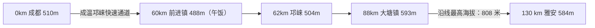

> 基本信息

- 全程 130 公里，全线很好的水泥路+柏油路。出发点成都海拔 510 米，途中最高点 808 米，终点海拔 584 米。
- 快到雅安有个金鸡关隧道，过隧道前停车摘下眼镜，同时准备好手电与尾灯。

> 客栈信息

- 邛崃前进镇前进旅馆家常饭（客栈+午饭点）

  地址：成温邛快速路出口右转往邛崃方向直行 650 米

  住宿、午饭，免费提供矿泉水，补充开水 电话：13551264465

- 雅安桃园山庄（青旅），雅安宜欧宾馆（标间） 马踏飞燕处

- 雅安住宿两家都是胖哥的，一家青旅床位间，一家是酒店标间，条件非常好

  胖哥电话（微信）：13608260024，18383525604

> 快递代收

- 四川省雅安市雨城区姚桥镇姚桥小区金马饭旅馆，张虎转（自己姓名），13608260024

> 车辆相关

- 邛崃捷安特：13880151888 邛崃美利达：18628099786

- 雅安美利达车行 318 川藏服务站：金鸡关隧道前 400 米坡顶处

  各类单车免费检查调试，骑行装备配件，免费开水，快递服务

  电话：18908160216，13795852534

- 雅安捷安特店 地址：西大街 186 号 电话：18908160216

### Day2. 雅安 - 新沟


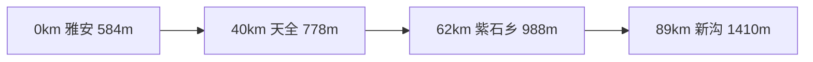

> 基本信息

- 柏油路+水泥路，雨季塌方高发路段。总体为起伏路

- 雅安到天全 40 公里，海拔爬升约 194 米，平均一公里约爬升 4.85 米。

- 天全到紫石乡 22 公里，海拔爬升约 210 米，平均一公里约爬升 9.5 米。

- 紫石乡到新沟 27 公里，海拔爬升约 422 米，平均一公里约爬升 15.6 米。

- 注意飞仙关岔路口


> 客栈信息

- 天全川味坊（午饭+住宿） 向阳大道 236 号快速安驾校对面 电话：15881202815

- 新沟聚缘食宿客栈 杨姐电话：13419345928，13398405108

- 新沟香川鱼庄客栈 柯姐电话：13981645075

> 快递代收

- 四川省雅安市天全县城厢镇向阳大道川味坊店，李娜转 XXX，15881202815

- 四川省雅安市天全县两路乡两路口村四组，杨姐转 XXX，13419345928

- 四川省雅安市天全县两路乡两路口村二组 36 号，柯贤蓉转 XXX，13981645075

> 车辆相关

- 天全捷安特：0835-8325668

- 新沟锋哥单车维修：13981640079

### Day3. 新沟 - 瓦斯沟


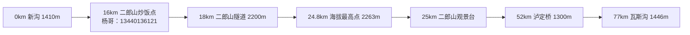

> 基本信息

- 总体水泥路，走二郎山隧道。二郎山是川藏线 318 上的第一座山，隧道口海拔 2200 米，新沟出发到隧道口 18 公里，爬升 790 米，平均一公里爬升 43 米，基本全是上坡。

- 新沟出发的队伍，会产生三个终点

  1. 新沟到康定 100 公里。

  2. 新沟到瓦斯沟 77 公里。

  3. 新沟到泸定 51 公里。如果二郎山是推车上去的，建议今天就在泸定停留，给自己一个体力适应的机会，然后第二天到康定，康定到折多塘，折多塘再到新都桥，所谓欲速则不达，如果本身体力就不是太好，又要拼命赶路那你只有欲速则搭（车）。

> 客栈信息

- 泸定驿旅客栈(瑞金路 186 号) 电话:15281565028，13990450002

- 瓦斯沟乡村排骨饭店 地址:泸定瓦斯沟公路左边(K2821+150 米) 董姐：15183605550

> 快递代收

- 四川甘孜泸定县安乐坝瑞金路 186 号舒珊转（自己名字），15281565028

> 车辆相关

- 泸定单车维修：15183621211

### Day4. 瓦斯沟 - 折多塘


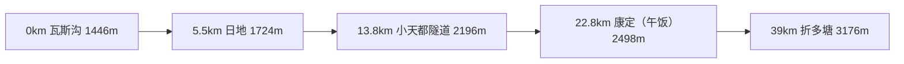

> 基本信息

- 瓦斯沟出发到康定城区 22.8 公里全程水泥路，康定到折多塘为柏油路，除了城区其他均为上坡路。

- 折多塘野温泉（旺季不用去，水太脏）位置行者路书编号：918220

> 客栈信息

- 折多塘贡嘎民居 电话：18227459021,15183627656

- 康定星月客栈 地址：情歌大道 36 号拉姆则林卡酒店后面 电话：18064997223

> 快递代收

- 四川省甘孜藏族自治州康定市炉城填情歌大道 36 号拉姆则林卡酒店停车场后星月客栈，邓红转，18064997223

> 车辆相关

- 康定美利达车行：18228789511

### Day.5 折多塘 - 新都桥 & Day.6 休整


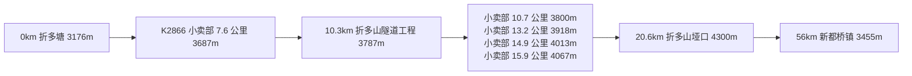

> 基本信息

- 全程柏油路。午饭干粮解决或小卖部泡面。

- 如果在上到海拔 3600 米左右高反不适（头痛、想吐等），建议退回到折多塘休整，第二天再试，如果还是不行就回家吧。

- 下山 6 公里处注意减速带，握紧车把，注意减速。

- 从垭口放坡，做好保暖，预防感冒。如果感觉困乏（醉氧），及时停下来休息。

- 到了 3200 米以上晚上睡不踏实是很正常的现象，以及蹲下去然后站起来时一定不能太猛。

> 客栈信息

- 新都桥瓦泽乡漫花客栈（k2913 + 800 米处）电话：13880118879， 18081170736

- 新都桥瓦泽乡欣悦客栈，新都桥瓦泽乡 318 国道路牌 K2915 前行 20 米处，右手边，段海宾：13892356406

> 快递代收

- 四川省康定新都桥镇漫花客栈，林哥转， 13880118879

> 车辆相关

- 无

### Day.7 新都桥 - 相克宗


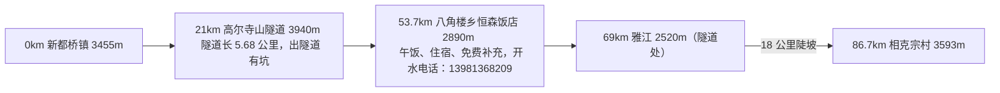

> 基本信息

- 全程柏油路，出隧道路面有坑。
- 从新都桥出发，会有一个岔路口，直行往塔公草原，左转就是我们要走的 318 国道。
- 高尔寺山目前多数走隧道。走隧道：长 5682 米，海拔 3940 米。走老路：翻高尔寺山上坡 12 公里烂路到达高尔寺山海拔 4412 米的垭口，垭口下去 14 公里烂路。总共约 26 公里是烂路。
- 重点 18km 陡上坡，平均坡度 6。参考二郎山 4.3，折多山 5.4

> 客栈信息

- 八角楼乡恒森饭店（K2966+1300 米） K2967

  午饭、住宿、免费补充开水

  电话：13981368209

- 相克宗贡嘎客栈(K3000+300 处)

  客栈里可以维修、调试单车，相克宗老板的维修技术在川藏线来说算是比较好的

  电话 15137905233，18227475345

> 快递代收

- 无

> 车辆相关

- 无

### Day.8 相克宗 - 红龙乡


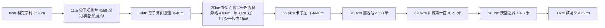

> 基本信息

- 全程良好柏油路。强度稍大，四坡起伏。

> 客栈信息

- 红龙乡牧家客栈 （K3082 处） 热情的贡嘎大叔 电话： 15984740794

> 快递代收

- 无

> 车辆相关

- 无

### Day.9 红龙乡 - 禾尼乡


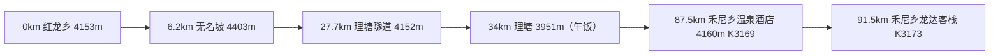

> 基本信息

- 全程上好的柏油路，理塘出发约 30 公里后电信，移动均没任何信号。

> 客栈信息

- 理塘漫步云端客栈（午饭+住宿）

- 禾尼乡毛垭温泉乡村酒店，标间，免费泡温泉，地址：K3169 处 程姐：18090426186

- 禾尼乡龙达线路连锁客栈（藏家客栈）(K3173 处) 高绒大叔：13548401279

> 快递代收

- 四川省甘孜州理塘县理乡路 355 漫步云端客栈，黄永学转，13568763261

> 车辆相关

- 无

### Day.10 禾尼乡 - 巴塘 & Day.11 休整


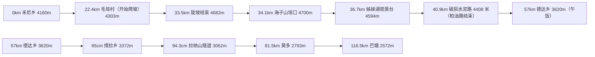

> 基本信息

- 禾尼乡出发有两种选择

  1. 直接到巴塘，然后可以考虑巴塘休整一天，洗洗衣服，逛逛街，总里程 117 公里。

  2. 海子山放坡到德达乡，第二天去措普沟玩玩，全程 57 公里。

     措普沟就是 318 国道出列衣隧道后右转离开 318 进去 38 公里这条沟。目前自驾的车，骑行的都不能自己单独进去，须包当地人的车才能进去。

     行者路书编号：921851

> 客栈信息

- 德达乡雅安温泉客栈(K3226+800 米)(禾尼乡到巴塘下海子山途中)

  标间、热水、WIFI、午饭、住宿集 57 遇见卡，免费提供开水

  电话：18981621325

- 巴塘金顶青年旅社（民族街 27 号）电话：13541898883，13568294465

> 快递代收

- 四川省甘孜巴塘县金弦子大道民族街金顶客栈，曲珍转，13541898883

> 车辆相关

- 巴塘维修：15884052719

### Day.12 巴塘 - 芒康


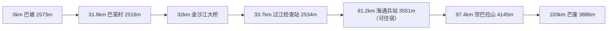

> 基本信息

- 路况较差，容易断道。

> 客栈信息

- 芒康吉祥宾馆 地址：（顺达加油站前走 500 米，丁字路口）电话：18898051978

> 快递代收

- 西藏昌都芒康县滨河路 2 一 6 号吉祥宾馆，红姐转，18898051978

> 车辆相关

- 无

### Day.13 芒康 - 登巴


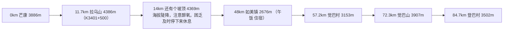

> 基本信息

- 芒康到左贡要翻三个垭口：拉乌山，觉巴山，5100 米的东达山，可以根据自己体力来分两天或者三天完成。

- 如果分三天走：

  - d1：芒康到如美 48 公里

  - d2：如美到东达山旅游中心 47 公里（标间），或再往前 4 公里荣许兵站（床位）

  - d3：东达山旅游中心到左贡 63.8 公里

- 凡入住荣许自贡饭店，东达山旅游中心的骑友，在登巴村到垭口途中遇到任何困难，联系东达山旅游中心客栈老板电话 17888059162，有求必应，凭 57 遇见卡在东达山垭口服务区可以免费加开水。

> 客栈信息

- 登巴村成都川美味川菜食宿店（午饭+住宿）（K3457） 杰哥：18228497928

- 东达山旅游中心（K3467） 超哥：17888059162

- 荣许兵站自贡饭店（午饭+住宿） 超哥：17888059162

- 东达山垭口服务区（午饭+开水） 超哥：17888059162

> 快递代收

- 无

> 车辆相关

- 无

### Day.14 登巴 - 左贡


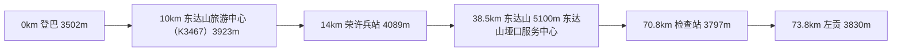

> 基本信息

- 在上到垭口之前就找个地方加衣服加雨衣。

> 客栈信息

- 东达山旅游中心（K3467）超哥：17888059162

- 荣许兵站自贡饭店 超哥：17888059162

- 东达山垭口服务中心（午饭）超哥：17888059162

- 左贡县蓝山青年旅社 检查站过去 3 公里 杨哥：13228959682，18589159515

> 快递代收

- 无

> 车辆相关

- 无

### Day.15 左贡 - 邦达


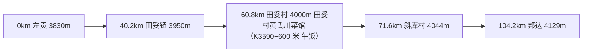

> 基本信息

- 微起伏，柏油路。

> 客栈信息

- 田妥村黄氏川菜馆(吃饭，住宿 补充开水)（K3590+600 米） 黄姐（微信）：15208051372，17711009263

- 邦达杰华宾馆 李杰：13882649766，二嫂：13568362867

> 快递代收

- 无

> 车辆相关

- 无

### Day.16 邦达 - 八宿


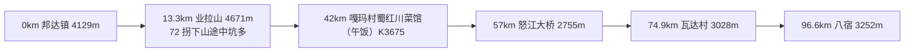

> 基本信息

- 全程柏油路，72 拐拐弯处路况稍差。

> 客栈信息

- 嘎玛村蜀红川菜馆 K3675，邦达到八宿（住宿 午饭点 免费补充开水）电话：18857214106

- 八宿云中间宾馆 地址：中石油加油站对面 电话：15971212339

> 快递代收

- 无

> 车辆相关

- 八宿维修：13663720230

### Day.17 八宿 - 然乌


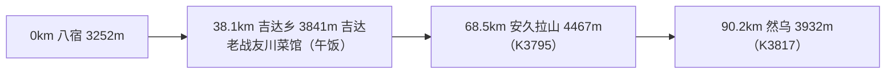

> 基本信息

- 全程柏油路。下安久拉山快到然乌的路背阴， 冬季容易暗冰。

- 然乌休整可以去看来古冰川。

> 客栈信息

- 吉达老战友川菜馆（午饭+住宿） 电话：18328377760，18882031329

- 然乌镇雪湖宾馆，然乌镇桥头右手第一家 电话：15807502033，15283103304

- 然乌成都馨雅酒店，闵哥：15208081810，13881646386

> 快递代收

- 无

> 车辆相关

- 无

### Day.18 然乌 - 波密 & Day.19 波密休整


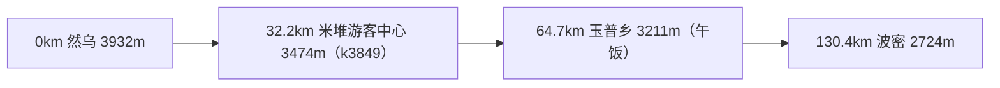

> 基本信息

- 起伏向下，注意然乌 18km 到林芝的下陡坡。

- 玉普乡出来，回望有座盔甲山，因为山上纹路像古代作战的盔甲得名。

> 客栈信息

- 57 波密渡口（原玉仁客栈）茂名北路完全小学旁（单车维修、调试） 浮生：18065908590

> 快递代收

- 西藏波密县茂名北路玉仁家庭旅馆，郑登城转，18065908590 波密澳斯堡西餐厅 阿波电话：17708940968

> 车辆相关

- 无

### Day.20 波密 - 通麦


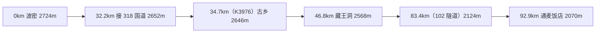


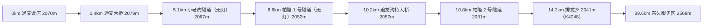

> 基本信息

- 波密出发的三种选择：

  1. 体力好赶路型的，可以直接到东久，全程 130 公里，然后第二天直接东久到八一，100 公里。

  2. 中规中矩型不赶路的，波密到通麦走常规线路 G318 国道到通麦，全程 92 公里。

  3. 喜欢摄影，猎奇，林间小路看美景的，穿越岗云杉林（游玩约需 1 个半小时），草湖景区从古乡出来回归 G318 国道到通麦，全程同样 92 公里，风景美到爆，当然下雨天估计那段小路会有点不美好。

- 穿越岗云杉林。行者路书编号：1978923

> 客栈信息

- 通麦饭店（午饭+住宿）（K4034 通麦镇兵站对面）尹姐电话：13322541327

- 鲁朗东久乡龙王谷驿站，地址：东久服务区 电话：18309209985， 15728942850

> 快递代收

- 无

> 车辆相关

- 无

### Day.21 通麦 - 鲁朗


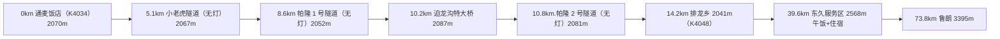

> 基本信息

- 如果中等体力可以波密到东久 130 公里，东久到八一公里 100 公里。

- 川藏线景色最漂亮还是然乌出来玉普乡开始，所以如果时间不紧还是建议波密到通麦，通麦到鲁朗，鲁朗到八一分三天走。

> 客栈信息

- 鲁朗东久龙王谷驿站(午饭+住宿) 地址：东久服务区 电话：18309209985，15728942850

- 鲁朗院长客栈 地址：鲁朗卫生院边 20 米处 电话：15858804560

> 快递代收

- 无

> 车辆相关

- 无

### Day.22 鲁朗 - 林芝巴宜区（八一）


```mermaid
flowchart LR
A[0km 鲁朗 3395m] --> B[3.8km 开始翻色季拉山 3462m] --> C[13.4km 水泥小坑路 4033m] --> D[15km 水泥坑路结束 4038m] --> E[18.6km 鲁朗游客中心 4292m] --> F[24.2km 垭口 4569m] --> G[55km 林芝镇 3027m] --> H[72.7km 八一 2988m]
```


> 基本信息

- 路况总体良好，柏油路为主。

> 客栈信息

- 林芝市巴宜区（八一）渡口客栈(原吉庆阁)地址：八一大街 376 号 橙子电话：13659591010，18636396217

> 快递代收

- 西藏林芝市巴宜区八一大街 376 号渡口客栈，橙子转，13659591010

> 车辆相关

-

### Day.23 八一 - 工布江达


```mermaid
flowchart LR
A[0km 八一镇 2988m] --> B[37km 更章乡 3185m \n 更章乡陕西小吃店13638942715] --> C[63.45km 百巴镇 3157m（午饭）] --> D[83.8km 巴河镇 3235m] --> E[130.4km 工布江达 3415m]
```

> 基本信息

- 新铺的柏油路，实在太好。

> 客栈信息

- 工布江达豫州商务宾馆（标间 冬季有暖气）有餐饮 地址：工布江达县高速出口处 318 国道旁 电话：18889045818

- 工布江达东旺安达骑友旅社（床位 ）（单车调试维修）县公安局东 30 米 电话：13518948720，18908941849

> 快递代收

- 无

> 车辆相关

- 无

### Day.24 工布江达 - 松多


```mermaid
flowchart LR
A[0km 工布江达 3415m] --> B[19.2km 中流砥柱3500m（已经全封闭）] --> C[43.4 金达镇3682m（午饭）] --> D[60.8km 加兴乡3893m（K4421）] --> E[96.9 松多镇4285m（K4456+200 米）]
```

> 基本信息

- 新铺柏油路，全程与八一到工布江达样路好，车少。

> 客栈信息

- 松多豫鑫旅馆 地址：进松多镇右侧第一家 电话：18708048035

> 快递代收

- 无

> 车辆相关

- 无

### Day.25 松多 - 拉萨


```mermaid
flowchart LR
A[0km 松多镇 4285m（K4456+200 米）] --> B[28.2km 米拉山垭口5025m] --> C[53.2km 日多乡4404m（午饭）] --> D[88.8km 扎西岗乡3973m] --> E[109.7 墨竹工卡县3835m]
```


```mermaid
flowchart LR
A[0km 墨竹工卡县3835m] --> B[9.2km 检查站3787m] --> C[57km 检查站3679m] --> D[72.6km 拉萨布达拉宫3660m]
```

> 基本信息

- 松多到拉萨全程 182 公里，如果打算一天到拉萨建议至少 6 点出发。墨竹工卡出发约 4 小时到达拉萨。

> 客栈信息

- 拉萨天空大杂院（57 勋章、行者盖章、证书勋章领取点）（单车打包，单车回收） 陈哥电话：18143288514

- 拉萨尘埃落定客栈（布达拉宫店）（单车打包、包裹代收服务） 57 勋章、证书勋章领取点 地址：拉萨市城关区林廓北路宗角新村 484 号（布达拉宫正后方约 400 米） 老七电话:18994315247，18689013838

> 快递代收

- 拉萨市城关区纳金中路邮运新村天空大杂院 陈哥转 XXX 收 电话：18143288514 （快递前请先联系）

- 拉萨市城关区宗角新村 484 号尘埃落定客栈布达拉宫店老七转 XXX 收 电话：18994315247

> 车辆相关

- 无

## 其他信息

### 长途线路行者路书

| 线路名称           | 路书编号 |
| ------------------ | -------- |
| 318 南线           | 424316   |
| 317 线             | 796441   |
| 川藏中线           | 792229   |
| 214 滇藏线         | 815906   |
| 219 新藏线         | 839271   |
| 阿里北线           | 443405   |
| 阿里大环线         | 933393   |
| 环青海             | 367953   |
| 德贡公路           | 791874   |
| 香格里拉大环线     | 1366678  |
| 环台湾             | 449996   |
| 川西小环线         | 830143   |
| 贡嘎山环线 6 天    | 868063   |
| 米亚罗小环线       | 897604   |
| 光零山转山路线     | 899166   |
| 徒步墨脱行者路书   | 1339854  |
| 皖南川藏线行者路书 | 955385   |
| 拉萨-聂拉木-樟木   | 1440041  |
| 环海南路线合       | 367817   |
| 环海南之环线       | 771508   |
| 环海南之西线       | 771493   |
| 214 滇藏线         | 815906   |
| 珠峰大本营         | 751711   |
| 阿里中线           | 889327   |
| 独库公路           | 919139   |
| 109 青藏线         | 839257   |
| 丙察察             | 372387   |
| 中越延边公路       | 448075   |
| 川西微环线         | 827200   |
| 贡嘎山环线 8 天    | 377891   |
| 黄龙小环线         | 898529   |
| 峨眉山环线         | 899321   |
| 波密到墨脱行者路书 | 1339774  |
| 乌江画廊           | 1384399  |
| 草原天路西线       | 423859   |

### 经典复刻——【当公路车遇上川藏线】【单飘骑行川藏线】真实的行者视角 别告诉妈妈你去了拉萨！

[TBearGrylls](https://www.bilibili.com/video/BV16W411P7kW/)

1. 成都 ➡️ 雅安 🚵🏼‍♂️140㏎
2. 雅安 ➡️ 天全 ➡️ 新沟 🚵🏼‍♂️85㏎
3. 新沟 ➡️ 二郎山 ➡️ 泸定 ➡️ 康定 🚵🏼‍♂️96㏎
4. 康定 ➡️ 折多山 ➡️ 新都桥 🚵🏼‍♂️78㏎
5. 新都桥 ➡️ 高尔寺山 ➡️ 雅江 ➡️ 相格宗 🚵🏼‍♂️91㏎
6. 相格宗 ➡️ 卡子拉山 ➡️ 理塘 🚵🏼‍♂️115.4㏎
7. 理塘 ➡️ 海子山 ➡️ 巴塘 🚵🏼‍♂️170.9㏎
8. 巴塘 ➡️ 宗拉山 ➡️ 芒康 🚵🏼‍♂️104㏎
9. 芒康 ➡️ 拉乌山 ➡️ 觉巴山 ➡️ 荣许兵站 🚵🏼‍♂️99.18㏎
10. 荣许兵站 ➡️ 东达山 ➡️ 左贡 ➡️ 田妥镇 🚵🏼‍♂️99.56㏎
11. 田妥镇 ➡️ 邦达 ➡️ 业拉山 ➡️ 怒江 72 拐 ➡️ 八宿 🚵🏼‍♂️160㏎
12. 八宿 ➡️ 安久拉山 ➡️ 然乌 🚵🏼‍♂️98㏎
13. 然乌 ➡️ 波密 🚵🏼‍♂️122.8㏎
14. 波密 ➡️ 通麦 ➡️ 鲁朗 🚵🏼‍♂️160㏎
15. 鲁朗 ➡️ 色季拉山 ➡️ 林芝 🚵🏼‍♂️73㏎
16. 林芝 ➡️ 工布江达 🚵🏼‍♂️128.6㏎
17. 工布江达 ➡️ 松多 🚵🏼‍♂️97.2㏎
18. 松多 ➡️ 米拉山 ➡️ 拉萨 🚵🏼‍♂️184.3㏎

[丶 Egoist 丿](https://www.bilibili.com/video/BV1pr4y1k7SN/)

1. 成都 ➡️ 雅安 ➡️ 天全 🚵🏼‍♂️169㏎
2. 天全 ↗ 二郎山隧道 ↘ 泸定 ↗ 康定 🚵🏼‍♂️154㏎
3. 康定 ↗ 折多山 ↘️ 新都桥 🚵🏼‍♂️76㏎
4. 新都桥 ↗ 高尔寺隧道 ↘️ 雅江 ↗ 相格宗 🚵🏼‍♂️82㏎
5. 相格宗 ↗ 卡子拉山 ↘️ 红龙乡 🚵🏼‍♂️81㏎
6. 红龙乡 ↗↘️ 理塘 ↗ 海子山 ↘️ 巴塘 🚵🏼‍♂️203㏎
7. 巴塘 ↗ 宗拉山 ↘️ 芒康 ↗ 拉乌山 ↘️ 如美镇 🚵🏼‍♂️150㏎
8. 如美镇 ↗ 觉巴山 ↘️ 登巴村 ↗ 东达山 🚵🏼‍♂️71㏎
9. 东达山 ↘️ 左贡 ➡️ 田妥村 🚵🏼‍♂️102㏎
10. 田妥村 ➡️ 邦达 ↗ 业拉山 ↘️72 拐 ↗ 八宿 🚵🏼‍♂️136㏎
11. 八宿 ↗ 安久拉山 ↘️ 然乌 🚵🏼‍♂️91㏎
12. 然乌 ↘️3888 留言墙 ↘️ 波密 🚵🏼‍♂️130㏎
13. 波密 ↘️ 通麦 ↗ 鲁朗 🚵🏼‍♂️158㏎
14. 鲁朗 ↗ 色季拉山 ↘️ 林芝 🚵🏼‍♂️73㏎
15. 林芝 ↗ 工布江达 🚵🏼‍♂️131㏎
16. 工布江达 ↗ 松多 🚵🏼‍♂️98㏎
17. 松多 ↗ 米拉山 ↘️ 墨竹工卡 ➡️ 拉萨 🚵🏼‍♂️185㏎

### [期末的西藏旅游攻略](https://www.bilibili.com/read/cv12052461/)

**行程**

**一.全局路线：**

杭州-西安（飞机）   西安-兰州-拉萨（火车） 拉萨-重庆-杭州（飞机）

因为杭州直飞兰州西宁的飞机太贵，所以我索性直接飞到了西安玩一天再出发去拉萨

杭州飞西安大概就 600-700 的机票，然后兰州到拉萨软卧差不多 700 多。硬卧会便宜一点，但我还是推荐坐软卧，会舒服很多；回来的时候坐的飞机，但是拉萨没有直飞杭州的航班，所以我选择了 重庆转机，机票其实都不贵。

记住：兰州/西宁到拉萨的火车票很紧缺，请提前很多天定，我是刷了很久才定上的，软卧的话，下铺风景比上铺好，供氧口也在下铺

**二.西藏当地路线及攻略：**

**day1：拉萨当地游玩，并完成租车：**

拉萨当地我们玩的不多，就逛了布达拉宫广场和八廓街以及大昭寺（主要也就这两个好玩的）。差不多从中午玩到了晚上。

视频里面很多人说我拉开窗帘看见布达拉宫的镜头是剪辑的，其实不是，拉萨很多酒店都可以拉开窗帘看到布达拉宫，但是被定完了，我们定的酒店反而不是最好的位置。

最好提前几天定，我们是当天定的，就定不到位置最好的了，只能定了在布达拉宫侧面的酒店，但是一样可以拉开窗帘看到布达拉宫

ps.定之前最好问一下酒店，帮你选一个能看到布达拉宫的房间，舒服很多。也可以自己上楼看看，如果看不见布达拉宫就提桶跑路，换一个。旅游嘛，不寒掺！

在拉萨室内玩的时候不建议开车，根本没地方停车，我们开了车出来转了一圈没地方停又只能回去了。

**day2：拉萨-纳木错-圣像天门**

纳木错观景点分两个，一个叫扎西半岛，另外一个叫圣像天门，扎西半岛近一点，圣象天门风景更牛逼一点。

拉萨到扎西半岛差不多 4 小时，扎西半岛到圣像天门需要 4-5 小时。如果只去扎西半岛，那么拉萨可以当天来回，如果去的是圣像天门，那么日出基本别想了（除非你学我，睡湖边），基本就是白天去白天回，晚上开车很难很难开。

路确实难开，不是弹幕说的我们见识少，我和 61 都是玩车的，路烂不烂我们当然知道，61 还是玩过越野的。视频里面真体现不出路烂罢了，30 多 km 的路我们走了得有 5 个小时，你们可以想一下。。路上抛锚的车也很多。

现在有高速了，如果从拉萨出发往返扎西半岛，可能当日就能走完，但是扎西半岛到圣象天门，应该还是只有烂路。

我看当地旅游团也挺多的，纳木错一日游也有。不过去的时候建议你背包里多赛两个那种小的氧气管，纳木错海拔太高了，不过好看是真的好看，个人觉得比羊湖好看！

ps.弹幕有人说我凭什么觉得他们会同意在圣象天门边上借宿，我解释一下：首先我看攻略，他们很多都是能睡营地的，我去的时候也确实有帐篷有床，但是就是拒绝了我们，我们给多少钱他们都不愿意（当然沟通的过程很礼貌），然后我提出给几百，就让我们冲个电也行，我们睡车里，他们也拒绝了，不知道是啥原因，我看弹幕是说这个营地不接散客。当时也不止我们一辆车在沟通，其他也有人在沟通的。

**day3：圣像天门-日喀则**

严格意义说今天没有景点，我们只是在赶路，但是一路上的风景真的无敌，（建议走 104 国道），104 国道贴着念青唐古拉山脉。全程差不多 8 小时（顺利的话），我们因为爆胎啥的中途耽误了差不多 4-5 小时，导致凌晨 2 点才到的日喀则。

日喀则是一个很现代的城市，完全不用担心住宿问题，我们定的全季宾馆就和江浙沪的全季差不多，还挺舒服的。日喀则有个很大的寺庙叫扎什伦布寺，这个寺还挺值得一去的，比拉萨大昭寺人少一点，味也更正一点，就是门票有点贵。

ps：拉萨、日喀则都是全市禁飞的，你要想飞无人机，就是在旅途中和景点

**day4：日喀则-定日县-珠峰**

全程差不多 5-6 小时，取决于你开车的速度。

珠峰是一个很大的风景区，一般分为两个景点玩，一个是珠峰观景台（离珠峰 40km），另外一个是珠峰大本营。

**大概的顺序是这样：**

1.离珠峰 80km 处会有提示你已经进入珠峰保护区，然后又一个类似景区的牌子，这个地方是不收费的，且运气好的话已经能看见珠峰了。

2.离珠峰大概 40km 的地方是景区的入口，这里要收钱了，然后进入景区，开 10 分钟就到观景台了，这个观景台叫加乌拉山口。这个观景台看珠峰是最爽的，珠峰周围几个 8000 米的山峰也都能看得见，我就是在这里看的日照金山。

3.观景台继续往前开，20km 才能到坐接驳车的地方，然后才能坐接驳车上珠峰大本营，这个地方有停车场，可以自己停车。所以假如你是自驾的话，一定要好好规划你自己的行程。

其实现在的珠峰大本营不算严格意义上的大本营，大本营因为环保问题 19 年开始就往后退了 2km，也就是现在的绒布寺附近，但这 2km 完全不影响你看珠峰的体验。

进景区的钱，车和人头单独算全，具体多少我忘了，一辆车加两个人好像得 4-5 百左右。我们第一天是到的观景台，拍完日落和星空后下山（注意别出景区，不然第二天又得花钱），观景台和珠峰大本营中间有一个旅馆，且只有这个旅馆，叫**天之路（没热水的）**，一天 200，但是起码有个歇脚的地方。而且老板人也很好，你想吃东西甚至还能自己炒菜。

**day5：珠峰大本营**

因为想拍星空，所以我给珠峰大本营留了一整天，我差不多是下午坐车上的大本营（只能坐他们的接驳车），然后在大本营待到第二天在下山。绒

布寺对面有唯一的一间旅馆，300 一天，有电热毯但是没供氧，离珠峰非常近，几乎就在山脚下面，晚上如果要拍星空，直接就在外面。（这里记得也要选一间能看到珠峰的房间，看我视频里的房间多好看！）门口就是珠峰！！如果你要过夜，就只能睡这家。

珠峰大本营天气变化的很快，珠峰基本每小时都能从乌云密布变到阳光高照，还是很适合拍延时摄影的。其实我觉得来都来了，大家还是多给珠峰一点时间，珠峰露头的时间很少，但是怎么说也是世界最高峰呀！给两天不过分！

ps：珠峰大本营其实不能飞无人机（但是我不知道），飞完晚上就有民警上门了，不过他也就警告了下，所以大家还是尽量别飞了，珠峰大本营离边境太近了，比较敏感。

**day6：珠峰-卡若拉冰川-浪卡子县**

从珠峰下来后我们打算再去一下冰川和羊湖，然后前往林芝，羊湖和卡若拉冰川都在浪卡子县边上，所以我们直接开车出发了，珠峰到浪卡子县差不多要 8 小时。我们中途看完卡若拉冰川后睡浪卡子县了。我们到卡若拉冰川的时候天气不太好，所以我没感受到冰川的震撼。浪卡子县倒是还可以，县城挺大的，竟然有串串。

**day7：羊湖-拉萨**

羊湖也是非常有名的高原湖，但是因为之前去纳木错和珠峰看到的风景实在是太过震撼，所以我们一致觉得羊湖和千岛湖差不多（也有可能是我们去的时候羊湖因为再夏季所以没雪）。

卡若拉冰川和羊湖这两个点我倒是觉得可去可不去，因为我个人觉得是不如纳木错和珠峰的，如果你是从拉萨出发去倒还好，我们是从珠峰过去的，开了几百公里，我觉得太累了，如果你只有几天的假期，不如好好走一下拉萨-纳木错-珠峰-拉萨这条线路。

我们从羊湖下来以后本想去林芝的，但是突然想回家了，所以就直接飞重庆-杭州回家了。

林芝就更远了，而且更适合桃花季节去，我看网上好多桃花纷飞的林芝航拍图，超级美。

**解释下一些评论和弹幕**

**1.“仿佛在另一个国度”这句话有问题**

这句话被弹幕喷了，我写的时候完全没觉得有问题，因为我默认我们国家的风景就是牛逼阿，所以仿佛在另外一个国度的意思就是西藏的风景和我内地看到的风景不一样嘛。

弹幕说是我的意思看不起祖国风光，大哥，你能不能看完视频再喷，我吹爆祖国河山好不好！！！我觉得完全是因为你不自信，默认觉得祖国不如国外你才套用到我的身上，离谱。

看的我贼生气。

**2.反复提疫情之下不能去国外，是不是觉得国内没有好风光**

有弹幕说我出国拍风光秀优越，拜托大哥，我完全没这个意思，我说这句话的意思是，就是因为正是我去过国外，所以我才可以很有底气的说，西藏风光牛逼！！！

如果我没说我去过国外，然后后面吹中国风光比外国好，你是不是又要杠我：为什么你能这么说，你国外都没出去过。

**3.藏民凭什么要同意你住宿**

这个上文解释过了，都是很客气的交流的，不同意我就睡车里，很自然的过程阿！他们在景区搭建营地，确实是提供住宿服务的，但是也确实拒绝了我们这样的散客，没问题阿。弹幕别喷我

**秘传攻略！**

**1.氧气瓶多少钱？**

其实氧气瓶真的便宜，我们是在闲鱼搜的，两个氧气瓶我们租了 7 天加起来才 400 多。。简直划算到爆炸。那种小的氧气瓶差不多 20 一罐的，说实话更多的是心理安慰作用；大氧气瓶才是王道，两个氧气瓶省着点用，一天吸个 2 小时，坚持 7 天没啥问题。我们在纳木错湖畔睡觉的时候都是吸全夜的。

**2.车里没地方放氧气瓶，怕高反咋办？**

建议在拉萨多待两天适应下，然后在高海拔地区不要乱跑，老老实实走路，适当休息，就没啥问题的，高原也没那么可怕的，我们只是行程太紧凑，且我是风光摄影师，我就是打算好了要靠这个氧气瓶在珠峰和纳木错边上过夜，所以才背着氧气瓶。

如果能慢慢来，那么高反也没那么可怕的。

**3.吃的怎么样？**

我们在拉萨吃的藏餐，也就是酥油茶、藏族拌面、甜茶啥的，味道其实还可以，也很便宜，我点了个甜茶结果给我上了一热水壶给我整懵了，但是甜茶确实挺好吃的！

其他的餐饮其实大多都是川渝地区过来的，味道都还行。（拉萨的牦牛火锅值得一试，我们甚至还生吃了牦牛肉！挺好吃的！！）拉萨餐饮基本就是小四川！

然后我们除了拉萨基本就是靠路边的餐厅停车吃饭，然后自己也带了自热火锅啥的，在纳木错过夜的时候挺有用的。

**4.租车：**

租车的话拉萨最大的应该就是火车站边上的一嗨租车了，尽量租个 suv，我们租的是最便宜的 suv，一天 300，弹幕有人杠我说怎么可能 300，那你一定是没租过车，在内地，我租的这个车差不多 100 出头一天，在西藏 300 一天很贵了，你帮租车行算算，一年如果能有三分之二的时间在出租，是不是一年就基本回本了？

虽然西藏路已经不错了，但是有时候还是需要 suv 或者越野车的。普拉多陆巡这种车差不多得一天 700 往上了，如果人多的话可以租，我们就两个人，还是省一点。我们算头算尾是 8 天，但是租车行比较好说话，按小时算，所以给我们算了 7 天，一共是 2100，一人 1100，行程一共是 2000km 左右，油费 1000。自己租车就是比较自由，跟团的话比较省心，但是你要是想拍星空或者日照金山啥的就比较困难了。

**5.带了哪些摄影设备？**

无人机我就带了大疆 mavic mini，然后我朋友觉得看我飞挺好玩，在兰州买了个 mavic air。现在想想得亏他买了个 mavic air，mini 在高原地区（尤其是在 4500 以上海拔），操控性非常差，高原空气太稀薄了，mini 真用不了，最后直接不受控制摔纳木错湖里面了，好在还有个 mavic air，不然后面的航拍全没了。

相机我带了 a7r3 和佳能 m5，镜头带了腾龙 28-75-F2.8、老蛙 12mmF2.8（星空）、蔡司 16-35F4、佳能 M 口 55-200（这个神头！很多镜头都是他拍的）、15-45mm。

然后带了 gopro、三脚架以及其他摄影配件

ps.无人机记得多带浆叶

**6.总共花销多少？**

其实我没仔细算过，因为我们两个人都在互相付钱

基本就是机票（1600）+火车票（700）+住宿（900）+吃的（500）+租车（1100）=4900，景点开销两个人 1000 不到。其他开销几百块钱，加起来差不多 6000 左右一个人，我们两个还是比较省的，买了很多巧克力饼干啥的，再纳木错没啥吃的就自己吃点饼干就好了。这个价格住宿和交通占用了大头，所以我觉得也还行，没大家想想的这么贵。

**7.应该穿什么衣服？**

就算是夏天去，也带好羽绒衣！我带了两条羽绒衣，有时候还不够用，不过如果是跟团游，然后晚上不出来的话，一件羽绒衣足够了，当然还是多多益善！

**补充:前往珠峰大本营还有其他方案**

1:乘坐环保车（新能源大巴）120 元一人（往返）

2:开电动汽车前往无需过路费
